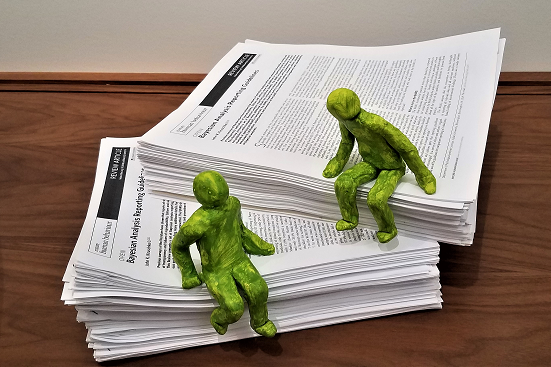

An open-access article in <i>Nature Human Behaviour:</i> [<b>Bayesian analysis reporting guidelines</b>](https://www.nature.com/articles/s41562-021-01177-7). 

With an extensive [<b>supplementary example</b>](https://osf.io/w7cph/).

[A blog post at *Nature*.](https://socialsciences.nature.com/posts/clear-and-reproducible-bayesian-statistical-reports)

The BARG provide a step-by-step list for reporting Bayesian data analyses, with explanations for each item, and a [summary table](https://www.nature.com/articles/s41562-021-01177-7/tables/1). For example:
<small><ul>
<li>Step 2.C. MCMC chain resolution: Report evidence that the chains have high resolution, using the effective sample size (ESS), for every parameter or derived value. This is distinct from, and in addition to, reporting evidence for convergence.
<li>Step 4.D. Bayes Factor, decision threshold and model probabilities: If using model comparison or hypothesis testing as the basis for a decision (you don't have to), state and justify the decision threshold for the posterior model probability, and the minimum prior model probability that would make the posterior model probability exceed the decision threshold.
<li>Step 6.D. Readable for humans: Make the posted script genuinely readable by human beings. Annotate the code with thorough explanatory comments and spatially arrange the code for human readability.
</ul></small>

The BARG will help achieve our collective goals as a scientific community and your individual goals to make clear and impactful contributions to science. If you are an author or a reviewer, try using the BARG. Encourage editors of journals to endorse the BARG in their instructions to authors and reviewers. 
