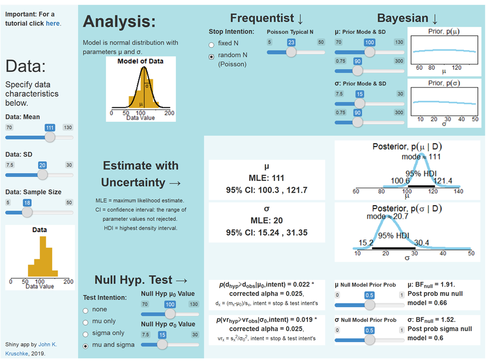

This is an interactive web app for doing Bayesian and frequentist analysis side by side. An extensive tutorial guides you through all the interactive capabilities. You get to see the different information delivered by Bayesian and frequentist analyses. You get to see the different information delivered by parameter estimation with uncertainty versus hypothesis testing. You get to interactively experience the dependencies of the analyses on different assumptions. 

<a href="KruschkeFreqAndBayesAppTutorial.html" target="_blank">
<b>The Shiny App: Frequentist and Bayesian Side by Side</b>
</a>

