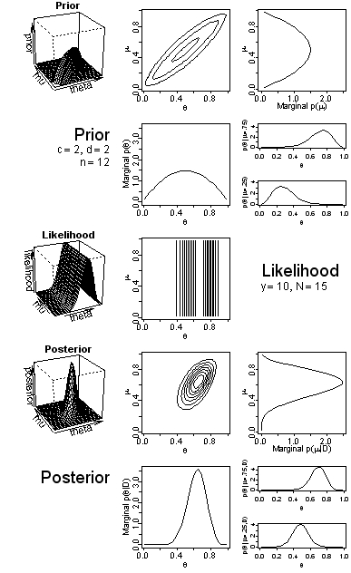

# Overview 

P533 is a tutorial introduction to doing Bayesian data analysis. The course is intended to make advanced Bayesian methods genuinely accessible to graduate students in the social sciences. Students from all fields are welcome and encouraged to enroll, and the course uses examples from a variety of disciplines. The course covers all the fundamental concepts of Bayesian methods, and works from the simplest models up through hierarchical models (a.k.a. multilevel models) applied to various types of data. More details about content are provided in the Schedule, below.

<!-- ```{r, echo=FALSE, out.width="200px", fig.align="center", fig.cap="Figure caption."} -->
<!--  -->
<!-- ``` -->

# Prerequisites

This is not a mathematical statistics course, but some math is unavoidable. If you understand basic summation notation like $\sum_i x_i$ and integral notation like $\int x \, dx$, then you're in good shape. We will not be using much math, especially after the first few weeks. 

We will, however, be doing a lot of computer programming in a language called R. R is free and can be installed on any computer. The textbook includes an introductory chapter on R and there are lots of resources online. 

A previous course in traditional statistics or probability can be helpful as background, but is not essential. P533 proceeds independently of traditional ("null hypothesis significance testing") statistical methods.

<!-- # Credit toward I.U. Statistics Department requirements -->

<!-- P533 counts toward the Ph.D. minor in STAT and toward the 12 hour "area relevant to statistics" section of the MSAS (Masters in Applied Statistics). -->

# Information online: Canvas

Our online hub for the course is IU [Canvas](https://canvas.iu.edu/). If you do not have access to Canvas, please notify Prof. Kruschke immediately. 

# Contact

## Instructor 

[Prof. John Kruschke](../../index.html) (pronounced "crush-kee"), kruschke@indiana.edu. Office hours by appointment; please *do* ask.

## Assistant 

See Canvas for info.

<!-- Brian Meagher (pronounced "marr"), bmeagher@iu.edu. Office hours: Mondays 1:00pm rm PY242. -->

# Required textbook

[*Doing Bayesian Data Analysis, 2nd Edition: A Tutorial with R, JAGS, and Stan*](https://sites.google.com/site/doingbayesiandataanalysis/), by John K. Kruschke. The book is available to students online through the IU Library; a link will be posted in Canvas.

<!-- https://www.sciencedirect.com/book/9780124058880/doing-bayesian-data-analysis -->

# Schedule

**Spring 2020: Tu/Th 9:30-10:45am, room PY 111**

The exact dates of some topics might flex, but the order of topics will be as shown below.

```{r echo=FALSE, results='asis'}
sched = read.csv("./P533Schedule.csv")
library(knitr)
kable(sched)
```

# Homework and course grade

There will be weekly homework assignments. You are encouraged to use whatever resources help you understand the homework and complete it with full comprehension, but ultimately you must write your own answers on you own and in your own words. Each homework assignment includes an honor statement indicating that you are writing your answers on your own in your own words. In your answers that you submit, please provide explanations and thoroughly show all your computations, with annotation that explains what you are doing. An unannotated succession of computations will not get full credit, even if it is numerically correct.

All assignments are mandatory. Late homework is exponentially penalized with a half-life of one week, meaning that after one week 50% is the maximum possible score. (The R program for the exponential decay is in the Canvas files; see LatePenaltyCalculator.R.) No homework may be turned in more than three weeks later than its due date, and no homework may be turned in after 12:00 noon of Wednesday of finals week. There are two reasons for this policy: First, the course moves quickly and the material is cumulative, so the late penalty acts as an extra incentive to keep up. Second, the assistant, who will be grading the homework, must not be given a flood of late homework papers at the end of the semester. In recognition of the fact that "life happens" (e.g., short-term illness, personal turmoil, overwhelming confluence of deadlines, etc.), your two worst late penalties will be dropped. In other words, for every homework we will record the scores with and without a late penalty. The two homeworks with the largest difference between with- and without- late penalty will have their late penalty dropped. *Note, therefore, that any homework not turned in will count as zero.*

Grading is based on your total homework score, as a percentile relative to the class. There are no exams and no projects. N.B.: Scores tend to be very high, so do not think that, say, 96% must be a grade of A because it could end up being an A- if, say, two thirds of the class does better than 96%. Typically the late penalties turn out to be a bigger deduction than points missed due to errors, so don't fall behind. As this is a graduate course, grades are typically in the A to high B range, and only rarely is a C or less assigned.

# Disclaimer

All information in this document is subject to change. Changes will be announced in class.

# University Policies

## Academic Integrity 

As a student at IU, you are expected to adhere to the standards detailed in the Code of Student Rights, Responsibilities, and Conduct (Code). Academic misconduct is defined as any activity that tends to undermine the academic integrity of the institution. Violations include: cheating, fabrication, plagiarism, interference, violation of course rules, and facilitating academic dishonesty. When you submit an assignment with your name on it, you are signifying that the work contained therein is yours, unless otherwise cited or referenced. Any ideas or materials taken from another source for either written or oral use must be fully acknowledged. All suspected violations of the Code will be reported to the Dean of Students and handled according to University policies. Sanctions for academic misconduct may include a failing grade on the assignment, reduction in your final course grade, and a failing grade in the course, among other possibilities. If you are unsure about the expectations for completing an assignment or taking a test or exam, be sure to seek clarification from your instructor in advance.

## Note Selling (Don't)

Several commercial services have approached students regarding selling class notes/study guides to their classmates. Selling the instructor's notes/study guides in this course is not permitted. Violations of this policy will be reported to the Dean of Students as academic misconduct (violation of course rules). Sanctions for academic misconduct may include a failing grade on the assignment for which the notes/study guides are being sold, a reduction in your final course grade, or a failing grade in the course, among other possibilities. Additionally, you should know that selling a faculty member's notes/study guides individually or on behalf of one of these services using IU email, or via Canvas may also constitute a violation of IU information technology and IU intellectual property policies; additional consequences may result.

## Online Course Materials

The faculty member teaching this course holds the exclusive right to distribute, modify, post, and reproduce course materials, including all written materials, study guides, lectures, assignments, exercises, and exams. While you are permitted to take notes on the online materials and lectures posted for this course for your personal use, you are not permitted to re-post in another forum, distribute, or reproduce content from this course without the express written permission of the faculty member. Any violation of this course rule will be reported to the appropriate university offices and officials, including to the Dean of Students as academic misconduct.
