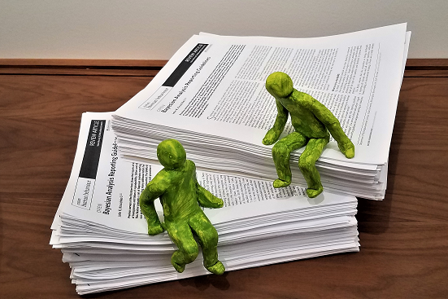

## <a href="http://scholar.google.com/citations?user=Im5IIiMAAAAJ&hl=en" target="_blank">Google Scholar page &rarr; </a>

## What to read first?

* <i>Social / Moral Psychology:</i>
    + <a href="https://doi.org/10.1177/00936502241253302" target="_blank"><b>Reactance to Persuasive Messages Depends on Felt Obligation</b></a>
    + <a href="https://doi.org/10.1177/10949968241228198" target="_blank"><b>An Intervention for Increasing Intention to Post Online Customer Reviews</b></a>
    + <a href="http://journal.sjdm.org/14/14721a/jdm14721a.pdf" target="_blank"><b>Ostracism and Fines in a Public Goods Game with Accidental Contributions</b></a>
    + <a href="https://osf.io/jth52/" target="_blank"><b>Lay evaluations of police and civilian use of force: Action severity scales</b></a>

* <i>Bayesian Data Analysis:</i>
    + <b>[Bayesian analysis reporting guidelines](BARG.html)</b>
    + <a href="http://link.springer.com/article/10.3758/s13423-016-1221-4" target="_blank"><b>The Bayesian New Statistics</b></a>. See also the [Shiny App](bayesAndFreqApp.html)!

* <i>Attention in Learning:</i>
    + <a href="./articles/Kruschke2011PWed.pdf" target="_blank"><b>Models of Attentional Learning</b></a>

* <b>[Poems](poems.html)</b>

