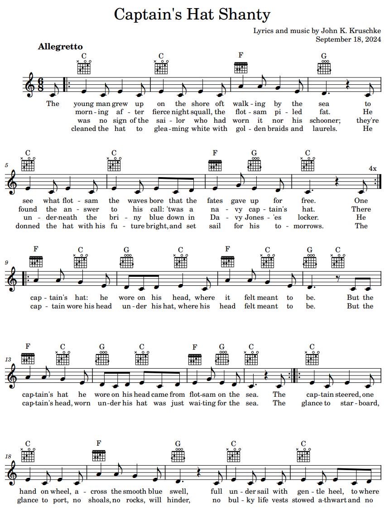

```{r child = '_poem_r_code.Rmd'}
```
<br>

## Captain's Hat Shanty
<br>
(song lyrics; link to sheet music is below)\

The young man grew up on the shore\
oft walking by the sea\
to see what flotsam the waves bore\
that the fates gave up for free.\

One morning after fierce night squall,\
the flotsam piled fat.\
He found the answer to his call:\
'twas a navy captain's hat.\

There was no sign of the sailor who\
had worn it nor his schooner;\
they're underneath the briny blue\
down in Davy Jones'es locker.\

He cleaned the hat to gleaming white\
with golden braids and laurels.\
He donned the hat with his future bright,\
and set sail for his tomorrows.\

[chorus 1]\
The captain's hat: he wore on his head,\
where it felt meant to be.\
But the captain's hat he wore on his head\
came from flotsam on the sea.\
The captain wore his head under his hat,\
where his head felt meant to be.\
But the captain's head, worn under his hat\
was just waiting for the sea.\

The captain steered, one hand on wheel,\
across the smooth blue swell,\
full under sail with gentle heel,\
to where fame and fortune dwell.\

A glance to starboard, glance to port,\
no shoals, no rocks, will hinder,\
no bulky life vests stowed athwart\
and no thought to the following wind.\

[chorus 2]\
The captain's hat: he wore on his head,\
where it felt meant to be.\
But the captain's hat he wore on his head\
came from flotsam on the sea.\
The captain wore his head under his hat,\
where his head felt meant to be.\
But the captain's head, worn under his hat\
was just boating on the sea.\

Jib and mainsail, wing and wing,\
a-flying on a dead run.\
But the shroud telltale told another thing:\
that his story time was done.\

Then clouds turned dark and sea turned dread\
with white capped waves Oh Crap!\
As the gale capsized the captain's head,\
the waves donned one more white cap.\

[chorus 3]\
The captain's hat: he wore on his head,\
where it felt meant to be.\
But the captain's hat he wore on his head\
is now flotsam on the sea.\
The captain wore his head under his hat,\
where his head felt meant to be.\
But the captain's head, worn under his hat\
is now sunken in the sea.\

<br><p>

<a href="CaptainsHatShanty.pdf" target="_blank">
 
PDF of sheet music
</a>

<small>
*Notes:* 
A friend invited me to his birthday party on a pontoon boat, and for fun he wore a captain's hat. He said he had found the captain’s hat as flotsam on the shoreline. That struck me as unavoidably metaphorical, so I wrote a song about it. The song is supposed to be vaguely in the style of 19th century sea shanties, with a driving
beat and simple melody, appropriate for singing in a tavern with many pints of grog. (And because it is 19th century, it also defaults to a male character, but feel free to sing along with gender-neutral pronouns.) The lyrics are meant to remind us that only human hubris lets us suppose we are captains of our fates. 
(If you would like to perform or record this song publicly, I would be delighted, and please contact me.)
</small>

<table style='width:100%'><tr>
<td style='width:100%; text-align:center'>[Poem List &#8593;](poems.html#sec-my_poems)</td>
</tr></table>
