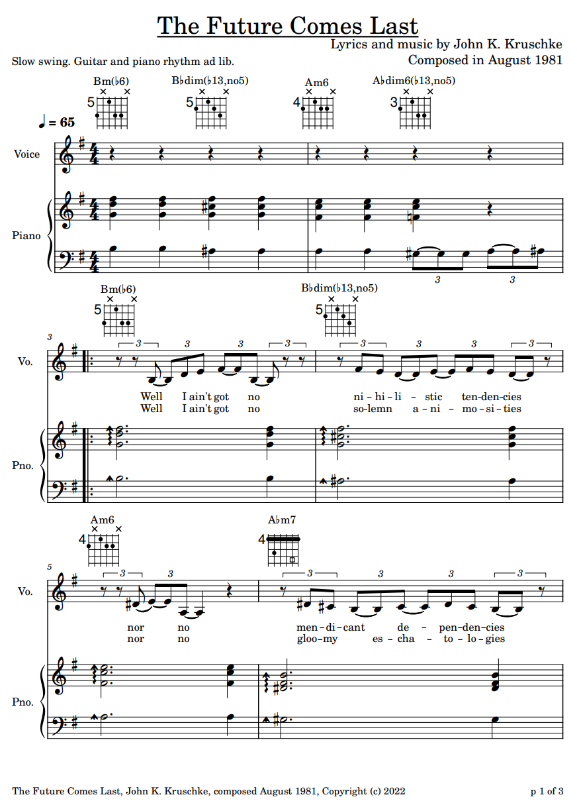

```{r child = '_poem_r_code.Rmd'}
```
<br>

## The Future Comes Last
<br>
(song lyrics; link to sheet music is below)\

Well, I ain't got no nihilistic tendencies,\
nor no mendicant dependencies,\
but facing facts, well it ain't free,\
it costs remembered reverie.\

But live for the future,\
live for the past,\
any way you do it,\
the future comes last,\
so you'd better eat now\
'cause tomorrow comes fast.\

Well, I ain't got no solemn animosities,\
nor no gloomy eschatologies,\
just hate to see the word *"finis,"*\
seems good times end too easily.\

But live for the future,\
live for the past,\
any way you do it,\
the future comes last,\
so you'd better eat now\
'cause tomorrow comes fast.\

<br><p>

<a href="Kruschke-TheFutureComesLast.pdf" target="_blank">
 
PDF of sheet music
</a>

<small>
*Notes:* Written when I was 19 years old, in August 1981. U.S. Copyright PAu004161008, 12 Nov 2022. (If you would like to perform or record this song publicly, I would be delighted, and please contact me.)
</small>

<table style='width:100%'><tr>
<td style='width:100%; text-align:center'>[Poem List &#8593;](poems.html#sec-my_poems)</td>
</tr></table>
