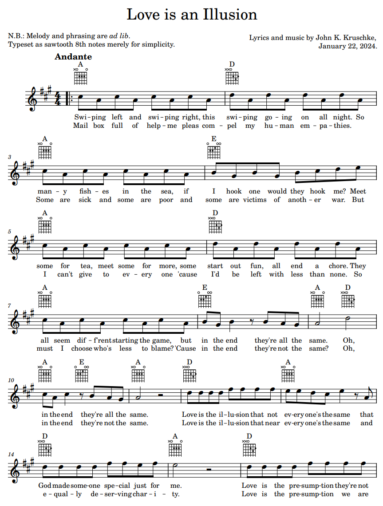

```{r child = '_poem_r_code.Rmd'}
```
<br>

## Love is an Illusion
<br>
(song lyrics; link to sheet music is below)\

[verse 1]\
Swiping left and swiping right, this swiping going on all night.\
So many fishes in the sea, if I hook one would they hook me?\
Meet some for tea, meet some for more, some start out fun, all end a chore.\
They all seem diff'rent starting the game, but in the end they're all the same.\
Oh, in the end they're all the same.\

[chorus 1]\
Love is the illusion that not every one's the same, that\
God made someone special just for me.\
Love is the presumption they're not just fish in the sea,\
and I wish someone were fishing just for me,\
and I wish someone were fishing just for me.\

[verse 2]\
Mail box full of help-me pleas compel my human empathies.\
Some are sick and some are poor and some are victims of another war.\
But I can't give to every one 'cause I'd be left with less than none.\
So must I choose who's less to blame? 'Cause in the end they're not the same?\
Oh, in the end they're not the same.\

[chorus 2]\
Love is the illusion that near everyone's the same\
and equally deserving charity.\
Love is the presumption we are all children of God,\
I just wish he loved his children equally,\
I just wish he loved his children equally.\

[bridge]\
If everyone's deserving across all humanity,\
then how can I pick only one for lifelong loyalty?\
If there's a perfect someone who is better than the rest\
then why should random people say it's better to divest?\

[chorus reprise and tag/outro]\
Love is the illusion that not every one's the same\
that God made someone special just for me.\
Love is the presumption they're not just fish in the sea,\
and I wish someone were fishing just for me.\
Love is the illusion that near every one's the same\
and equally deserving charity.\
Love is the presumption we are all children of God,\
I just wish he loved his children equally,\
I just wish God loved this child specially.\

<br><p>

<a href="LoveIsAnIllusion.pdf" target="_blank">
 
PDF of sheet music
</a>

<small>
*Notes:* In Meredith Root-Bernstein's book, *Hock*, there is a poem titled "Mardeena Pompon" with this epigraph: "Love is the illusion that one person differs from another. -- Avner Offer, The Challenge of Affluence." The epigraph grabbed my mind, and became the seed for this poem/song. (If you would like to perform or record this song publicly, I would be delighted, and please contact me.)
</small>

<table style='width:100%'><tr>
<td style='width:100%; text-align:center'>[Poem List &#8593;](poems.html#sec-my_poems)</td>
</tr></table>
