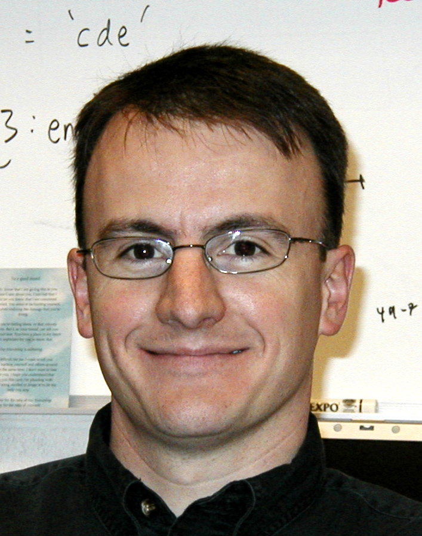
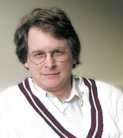
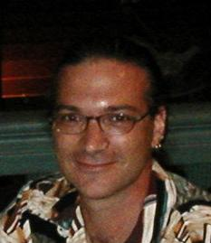

Here is a list of some of the students or post-docs with whom I have published. At the end is a brief appreciation of my own graduate-school mentor. (My apologies for not keeping the biographical information updated often enough.)

 <!-- ----------------------------------------------- -->

**Seungjoo (SJ) Yang**

Ph.D. 2023. During grad school, SJ had summer fellowships, a dissertation year fellowship, and was a paid intern at Netflix. After grad school, SJ is a product manager in the media and telecommunications industry, specializing in user experience and consumer insights research. 

<small>

* Yang, S., &amp; Kruschke, J. K. (2024). <a href="https://doi.org/10.1177/00936502241253302" target="_blank">Reactance to Persuasive Messages Depends on Felt Obligation</a>. <i>Communication Research</i>.

* Yang, S., &amp; Kruschke, J. K. (2024). <a href="https://doi.org/10.1177/10949968241228198" target="_blank">An Intervention for Increasing Intention to Post Online Customer Reviews</a>. <i>Journal of Interactive Marketing</i>.

</small>

 <!-- ----------------------------------------------- -->

**Binyan Li**

PhD anticipated 2020's. Primary advisor is Fritz Breithaupt.

<small>

* Breithaupt, F., Li, B., &amp; Kruschke, J. K. (2022). Serial reproduction of narratives preserves emotional appraisals. <i>Cognition and Emotion</i> https://doi.org/10.1080/02699931.2022.2031906

</small>

 <!-- ----------------------------------------------- -->

**<a href="https://bradcelestin.com/about.html" target="_blank">Brad Celestin</a>**

Ph.D. 2019. Assistant Professor, Chair of Psychology and Philosophy, Director of Software Development, at Bethel College, KS. Then Senior Scientist with the Cognitive Performance Group, LLC. 

<small>

* Celestin, B. D., &amp; Kruschke, J. K. (2019). Lay evaluations of police and civilian use of force: Action severity scales. <i>Law and Human Behavior</i>, 43(3), 290-305.

</small>

 <!-- ----------------------------------------------- -->

**Torrin Liddell**

Ph.D. 2018. Director of Research and Data Analytics at the Indiana Public Defender Commission, Indianapolis.

<small>

* Liddell, T. M. &amp; Kruschke, J. K. (2014). Ostracism and fines in a public goods game with accidental contributions: The importance of punishment type. <i>Judgment and Decision Making</i>, 9(6), 523-547.

* Liddell, T. M., &amp; Kruschke, J. K. (2018). Analyzing ordinal data with metric models: What could possibly go wrong? <i>Journal of Experimental Social Psychology</i>, 79, 328-348.

* Kruschke, J. K., &amp; Liddell, T. M. (2018).  The Bayesian New Statistics: Hypothesis testing, estimation, meta-analysis, and power analysis from a Bayesian perspective. <i>Psychonomic Bulletin & Review</i>, 25, 178-206.

* Kruschke, J. K., &amp; Liddell, T. M. (2018). Bayesian data analysis for newcomers. <i>Psychonomic Bulletin & Review</i>, 25, 155-177.

* Breithaupt, F., Gardner, K. M., Kruschke, J. K., Liddell, T. M., &amp; Zorowitz, S. (2013). The disappearance of moral choice in serially reproduced narratives. Workshop on Computational Models of Narrative, 36-42.

</small>

 <!-- ----------------------------------------------- -->

**Woo-Young (Young) Ahn**

Ph.D. 2012. Primary advisor was Jerome Busemeyer, also Brian O'Donnell and Julie Stout. Post-doc at Virginia Tech, then joined the faculty of Ohio State University, then Seoul National University.

<small>

* Ahn, W.-Y., Vasilev, G., Lee, S.-H., Busemeyer, J. R., Kruschke, J. K., Bechara, A., &amp; Vassileva, J. (2014). Decision-making in stimulant and opiate addicts in protracted abstinence: evidence from computational modeling with pure users. <i>Frontiers in Psychology: Decision Neuroscience</i>, 5(00849).

</small>

 <!-- ----------------------------------------------- -->

**Rick Hullinger**

Ph.D. 2011. Teaching awards in grad school. Senior Lecturer and Director of Undergraduate Instruction, Dept of Psych and Brain Sci at Indiana University.

<small>

* Hullinger, R. A., Kruschke, J. K., and Todd, P. M. (2015). An Evolutionary Analysis of Learned Attention. <em>Cognitive Science</em>, 39, 1172-1215.

* Kruschke, J. K., and Hullinger, R. A. (2010).  Evolution of attention in learning.  In: N. A. Schmajuk (Ed.), <em>Computational models of conditioning</em>. Cambridge University Press.

</small>

 <!-- ----------------------------------------------- -->

**Stephen Denton**

Ph.D. 2009. Post-doctoral research with Rich Shiffrin and Rob Nosofsky at I.U., then Tom Palmeri at Vanderbilt U. Then professional research and data analyst in Toronto, Canada. Senior Manager, Data Science & Model Innovation, Scotiabank.

<small>

* Kruschke, J. K., and Denton, S. E. (2010).  Backward blocking of relevance-indicating cues: Evidence for locally Bayesian learning. In: C. J. Mitchell and M. E. LePelley (Eds.), <em>Attention and Learning</em>, pp. 278-304. Oxford, UK: Oxford University Press.

* Denton, S. E., Kruschke, J. K., &amp; Erickson, M. A. (2008). Rule-based extrapolation: A continuing challenge for exemplar models. <em>Psychonomic Bulletin &amp; Review</em>, <b>15</b>(4), 780-786.

* Denton, S. E., &amp; Kruschke, J. K. (2006). Attention and salience in associative blocking. <em>Learning &amp; Behavior</em>, <b>34</b>(3), 285-304.

</small>

 <!-- ----------------------------------------------- -->

**Anthony Bishara**

Post doctoral researcher, 2006-2008, working primarily with Julie Stout and Jerome Busemeyer. Professor, Dept of Psychology, College of Charleston, South Carolina.

<small>

* Bishara, A. J., Kruschke, J. K., Stout, J. C., Bechara, A., McCabe, D. P., &amp; Busemeyer, J. R.  (2009).  Sequential learning models for the Wisconsin card sort task: Assessing processes in substance dependent individuals.  <em>Journal of Mathematical Psychology</em>, <b>54</b>, 5-13.

</small>

 <!-- ----------------------------------------------- -->

**Emily Kappenman**

B.S. with Honors, 2005. Emily was co-advised by Bill Hetrick. Emily won the Psychology Department's J. R. Kantor Award for excellence in undergraduate research, and subsequently won an NSF Graduate Fellowship. In graduate school she worked with Steve Luck at the University of California at Davis. Then joined the faculty of the Dept of Psychology at San Diego State University.

<small>

* Kruschke, J. K., Kappenman, E. S. & Hetrick, W. P. (2005). Eye gaze and individual differences consistent with learned attention in associative blocking and highlighting. <em>Journal of Experimental Psychology: Learning, Memory & Cognition</em>, <b>31</b>(5), 830-845.

</small>

 <!-- ----------------------------------------------- -->

**Mark Johansen**

Ph.D. 2002. Senior Lecturer, School of Psychology, Cardiff University, Wales.

<small>

* Johansen, M. K., &amp; Kruschke, J. K. (2005). Category representation for classification and feature inference.  <em>Journal of Experimental Psychology: Learning, Memory & Cognition</em>, <b>31</b>(6), 1433-1458.

* Kruschke, J. K., & Johansen, M. K. (1999).  A Model of Probabilistic Category Learning.  <em>Journal of Experimental Psychology: Learning, Memory and Cognition</em>, <strong>25</strong>, 1083-1119.

</small>

 <!-- ----------------------------------------------- -->

**Nate Blair**

Ph.D. 2001. Nate did post-doctoral research with Barbara Dosher at the University of California at Irvine. Then he became a Lecturer in the Dept of Psychology at California State University Sacramento. Tragically, Nate succumbed to multiple sclerosis in 2015.

<small>

* Kruschke, J. K. & Blair, N. J. (2000).  Blocking and backward blocking involve learned inattention.  <em>Psychonomic Bulletin & Review</em>, <strong>7</strong>, 636-645.

</small>

 <!-- ----------------------------------------------- -->

**Teresa Treat**

Ph.D. 2000. Teresa's primary mentor was Dick McFall, but Teresa devoted a lot of energy to our lab too. After a clinical intership, she joined the faculty of Yale University. Professor, Dept of Psychological and Brain Sci, University of Iowa.

<small>

* Treat, T. A., Viken, R. J., Kruschke, J. K., and McFall, R. M. (2009). Role of attention, memory, and covatiation-detection processes in clinically significant eating-disorder symptoms. <em>Journal of Mathematical Psychology</em>, <b>54</b>, 184-195.</a>

* Treat, T. A., McFall, R. M., Viken, R. J., Kruschke, J. K., Nosofsky, R. M., &amp; Wang, S. S. (2007). Clinical cognitive science: Applying quantitative models of cognitive processing to examine cognitive aspects of psychopathology. In R. W. J. Neufeld (Ed.), <em>Advances in Clinical Cognitive Science</em>, pp. 179-205. Washington, D. C.: American Psychological Association.

* Treat, T. A., McFall, R. M., Viken, R. J., Nosofsky, R. M., MacKay, D. B., & Kruschke, J. K. (2002).  Assessing clinically relevant perceptual organization with multidimensional scaling techniques. <em>Psychological Assessment</em>, <strong>14</strong>, 239-252.

* Treat, T. A., McFall, R. M., Viken, R. J. & Kruschke, J. K. (2001). Using cognitive science methods to assess the role of social information processing in sexually coercive behavior. <em>Psychological Assessment</em>, <strong>13</strong>, 549-565.

</small>

 <!-- ----------------------------------------------- -->

**Michael Erickson**

Ph.D. 1999. Outstanding Dissertation Award from the I.U. Cognitive
Science Program. Michael did post-doctoral research with Lynne Reder and then Jay
McClelland at Carnegie Mellon University. Michael then joined the faculty
of the University of California at Riverside, and then the faculty of
Hawaii Pacific University. Visiting Associate Professor at UC Riverside.

<small>

* Denton, S. E., Kruschke, J. K., &amp; Erickson, M. A. (2008). Rule-based extrapolation: A continuing challenge for exemplar models. <em>Psychonomic Bulletin &amp; Review</em>.

* Erickson, M.  A. & Kruschke, J. K. (2002).  Rule-based extrapolation in perceptual categorization.  <em>Psychonomic Bulletin & Review</em>, <strong>9</strong>, 160-168.

* Erickson, M.  A. & Kruschke, J. K. (1998).  Rules and Exemplars in Category Learning.  <em>Journal of Experimental Psychology: General</em>, <strong>127</strong>, 107-140.

* Kruschke, J. K. & Erickson, M.  A. (1994).  Learning of rules that have high-frequency exceptions: New empirical data and a hybrid connectionist model. In: <em> Proceedings of the Sixteenth Annual Conference of the Cognitive Science Society</em>, pp.514-519. Hillsdale, NJ: Erlbaum.</a>

</small>

 <!-- ----------------------------------------------- -->

**Mike Kalish**

Post-doctoral researcher, 1993-1995. Mike then joined the faculty of the University of Western Australia, Perth,  then the University of Louisiana at Lafayette, and then Professor, Dept of Psychology, Syracuse University.

<small>

* Kalish, M. L., Lewandowsky, S., and Kruschke, J. K. (2004). Population of linear experts: Knowledge partitioning and function learning. <em>Psychological Review</em>, <strong>111</strong>(4), 1072-1099.

* Kalish, M. L. & Kruschke, J. K. (2000).  The role of attention shifts in the categorization of continuous dimensioned stimuli. <em>Psychological Research</em>, <strong>64</strong>, 105-116.

* Kalish, M. L. & Kruschke, J. K. (1997).  Decision boundaries in one dimensional categorization. <em>Journal of Experimental Psychology: Learning, Memory and Cognition</em>, <strong>23</strong>, 1362-1377.

</small>

 <!-- ----------------------------------------------- -->

### My graduate school mentor

My (Kruschke's) graduate mentor was <em><b>Prof. Stephen Palmer</b></em>, University of California at Berkeley, during the years 1983-1989.  Steve was tremendously supportive and encouraging of my intellectual pursuits. He showed me repeatedly --by example and by direct instruction-- what it meant to think rigorously and incisively, and what it meant to write and present clearly. (BTW, his textbook, <a href="https://mitpress.mit.edu/books/vision-science" target="_blank">Vision Science</a>, is nothing less than monumental and shows the clarity and scope of his teaching.) He was perspicacious enough to teach a seminar regarding the just-published PDP (parallel distributed processing, a.k.a. connectionism) books, which became a launching pad for my subsequent ideas. I worked hard on a number of projects with Steve (regarding reference frames in shape perception), and with Danny Kahneman and Anne Triesman and John S. Watson (regarding perception of causality). Unfortunately, none of the projects produced data that were publishable! The lack of publications meant that Steve's support was all the more crucial. Danny Kahneman told me, as I was fearfully sending out job applications, "At this point Steve can do more for you than you can do for you." Thanks Steve!
 &nbsp;&nbsp;&nbsp;&nbsp;The previous paragraph has been posted for decades. Tragically, Steve Palmer died in 2023 (age 75). He is remembered and he is missed.

