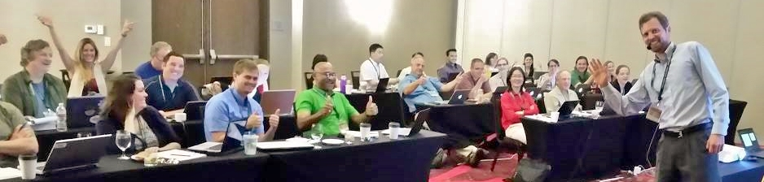

<h3>Courses at Indiana University:</h3>

<ul>

<li>
<a href="./jkkteach/P484MoralJudgment/index.html" target="_blank">
P484/P640 Science of Moral Judgment. (Moral psychology.)
</a>

<li>
<a href="./jkkteach/P457MoralMachines/index.html" target="_blank">
P457/P657 Moral Machines. (Artificial moral agents, machine ethics.)
</a>

<li> <a href="./jkkteach/P533/index.html" target="_blank">
P533 Introduction to Bayesian Data Analysis
</a>

<li> <a href="./jkkteach/P553/index.html" target="_blank">
P553 Introduction to Frequentist Data Analysis
</a>

<li>
<a href="./jkkteach/P747BayesModelsOfCogn/index.html" target="_blank">P747 Fall 2011: Doing Bayesian Models of Cognition.</a>

<li>
<a href="./jkkteach/P747BayesAdaptiveDesign/index.html" target="_blank">
P747 Spring 2011: Bayesian adaptive research design.</a>

<li>
P747 Spring 2010: Readings re Bayesian models of reasoning, learning,
perception, development, and the brain.

<li> <a href="./jkkteach/P554/index.html" target="_blank">
P554 Statistics in Psychology</a>

<li> <a href="./jkkteach/K300/index.html" target="_blank"> K300
Statistics</a>

<li> <a href="./jkkteach/P747_2004/index.html" target="_blank"> P747
Spring 2004. Topic: Advanced Model Fitting and Model Comparison</a>

<li> <a href="./jkkteach/Q550/index.html" target="_blank">
Q550 Models in Cognitive Science</a>

<li> <a href="./jkkteach/Q560/index.html" target="_blank">
Q560 Experimental Methods in Cognitive Science</a>

<li> <a href="./jkkteach/P335/index.html" target="_blank">
P335 Cognitive Psychology</a>

<li> <a href="./jkkteach/Q750/index.html" target="_blank">
Q750 Recent Advances in Connectionist Models</a>

<li> Q500 Guest Lectures:
 <a href="./jkkteach/Q500/categorization.html" target="_blank">27 Sept., 1995</a>,  <a href="icp96.html" target="_blank">6 Nov. 1996 (expanded version of this symposium talk)</a>.

</ul>

<h3>Workshops and Tutorials in Bayesian Data Analysis:</h3>

A complete list of workshops and tutorials convened at various locations is provided <a href="https://sites.google.com/site/doingbayesiandataanalysis/workshops" target="_blank"><b>here</b></a>

